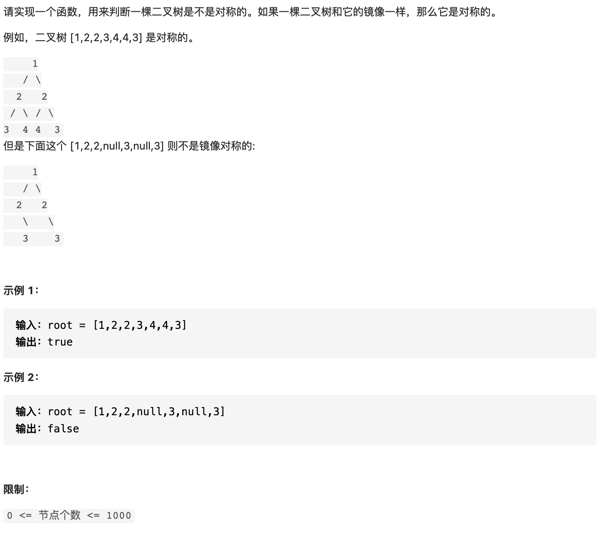

# 25 合并两个排序的列表




```text
/**
 * Definition for singly-linked list.
 * public class ListNode {
 *     int val;
 *     ListNode next;
 *     ListNode(int x) { val = x; }
 * }
 */
class Solution {
    public ListNode mergeTwoLists(ListNode l1, ListNode l2) {
        ListNode dum = new ListNode(0);
        ListNode cur = dum;
        while(l1 != null && l2 != null)
        {
            if(l1.val <= l2.val)
            {
                cur.next = l1;
                l1 = l1.next;
            }
            else
            {
                cur.next = l2;
                l2 = l2.next;
            }
            cur = cur.next;
        }
        cur.next = l1==null?l2:l1;
        return dum.next;
    }
}
```

