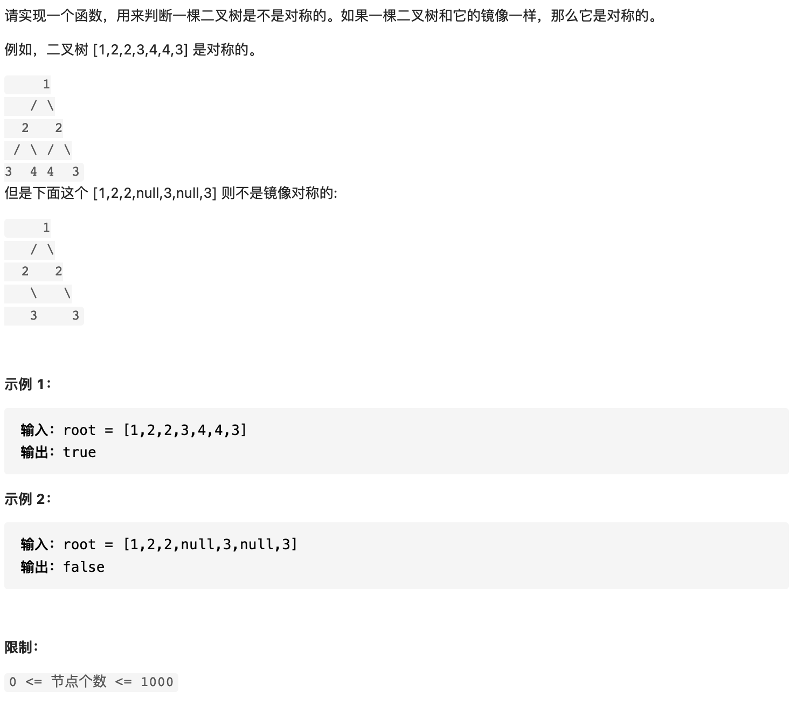

# 28 对称的二叉树



Noob's Solution:

```text
/**
 * Definition for a binary tree node.
 * public class TreeNode {
 *     int val;
 *     TreeNode left;
 *     TreeNode right;
 *     TreeNode(int x) { val = x; }
 * }
 */
class Solution {
    public boolean isSymmetric(TreeNode root) {
        if(root == null)
            return true;
        return mirror(root.right,root.left);
    }

    private boolean mirror(TreeNode r, TreeNode l)
    {
        if(r == null && l == null)
            return true;
        if(r == null || l == null)
            return false;
        if(r.val != l.val)
            return false;
        return mirror(r.right,l.left) && mirror(r.left,l.right);
    }
}
```

写得有点久.

依然还是大佬的简洁:

```text
class Solution {
    public boolean isSymmetric(TreeNode root) {
        return root == null ? true : recur(root.left, root.right);
    }
    boolean recur(TreeNode L, TreeNode R) {
        if(L == null && R == null) return true;
        if(L == null || R == null || L.val != R.val) return false;
        return recur(L.left, R.right) && recur(L.right, R.left);
    }
}

作者：jyd
链接：https://leetcode-cn.com/problems/dui-cheng-de-er-cha-shu-lcof/solution/mian-shi-ti-28-dui-cheng-de-er-cha-shu-di-gui-qing/
来源：力扣（LeetCode）
著作权归作者所有。商业转载请联系作者获得授权，非商业转载请注明出处。
```

